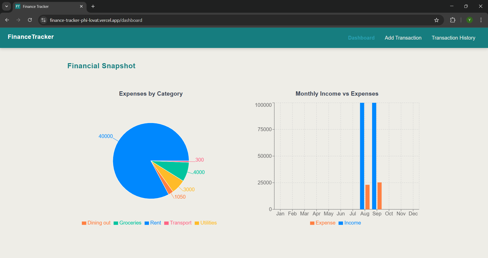
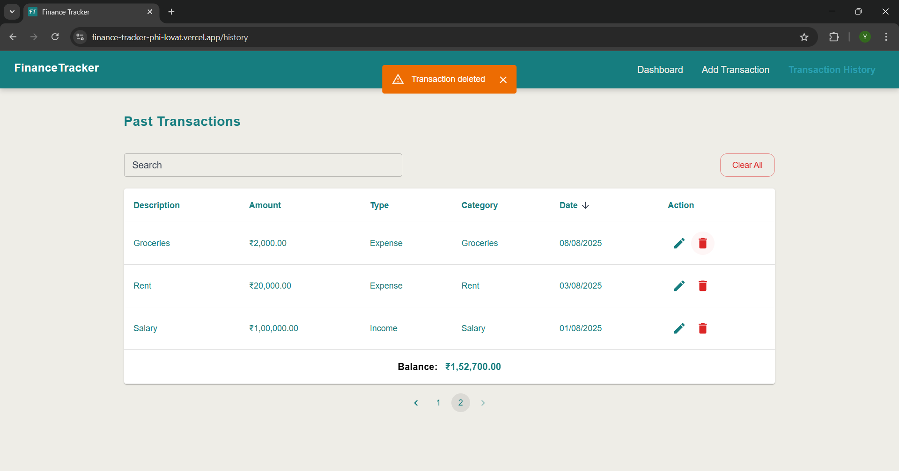

# Finance Tracker

A simple **personal finance tracker** built with **React, Redux Toolkit, Material-UI, and Recharts**.  
This app helps users manage their income & expenses, track balances, and visualize financial data easily.

---

## Features

### Dashboard
- Overview of **income, expenses**.
- **Pie chart** showing Expenses by category.
- **Bar chart** for Monthly Income v/s Expenses.

*Screenshot: Dashboard*  



---

### Add Transaction
- Add **new transactions** with:
  - Description
  - Amount
  - Type (**Income** / **Expense**)
  - Category (Food, Transport, Salary etc.)
  - Date  
- **Validation**: No field can be left blank.  
- Success & error notifications with **Toast**.  

*Screenshot: Add Transaction*  


---

### Transaction History
- Table view of all past transactions.  
- **Search** by description, category, or type.  
- **Sorting** by amount & date.  
- **Pagination** for easy navigation.  
- **Edit transaction**  
- **Delete single transaction**.  
- **Clear all transactions**.  
- Balance always displayed at the bottom.  
- All data is **persisted in localStorage**.

*Screenshot: Transaction History*  


*Screenshot: Edit Transaction*


---

### Toast Notifications
- Success, error, and warning messages shown with **Material-UI Toasts**.  
- Positioned neatly at the top-center.  

*Screenshot: Toast Notification*  



---

## Tech Stack

- **Frontend:** React, Redux Toolkit, Material-UI  
- **Charts:** Recharts  
- **State Management:** Redux  
- **Storage:** LocalStorage (persists user data even after refresh)  

---

## Setup & Run Instructions

### Clone the repository
```bash
git clone https://github.com/YashasviRawat15/financeTracker.git
cd finance-tracker
```

### Install dependencies
```bash
npm install
```

### Run the development server
```bash
npm run dev
```

### Build for production
```bash
npm run build
```

## Author

Yashasvi Rawat
